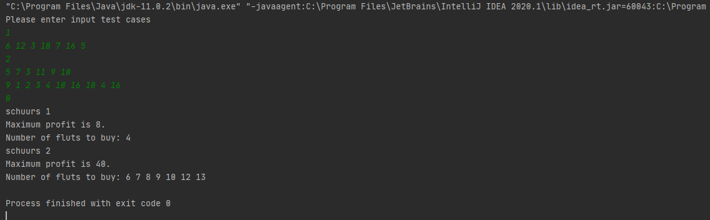

# Trader App
Calculates maximum profit  **Trader**. 

### Screenshots
Sample           |
:---------------------:
 

### Requirements 🔧
* Java version 8 or higher.

### Installation 🔌
1. Press the **Fork** button (top right the page) to save copy of this project on your account.

2. Download the repository files (project) from the download section or clone this project by typing in the bash the following command:

       git clone https://github.com/tvuchova/TradingFlutProfiter.git
3. Imported it in Intellij IDEA or any other Java IDE.
4. Run the application :D

### Algorithm 💡
The idea is to construct Array of profits comparing to price 10 (in Holland) .So accumulating profit
for array : 12 3 10 7 16 5 is : -2 5 5 8 2 7.In this aray maximum is 8 and the fluts are 4.
When we have schuurs bigger than 1 ,then we find maximum value for every list and list of
positions in case of equal max elements.Then we need to sum the profits of all lists and
sum all combinations ,taking into account first 10 sums.